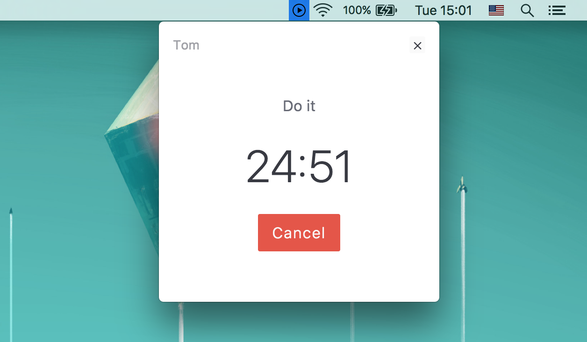

# thomas [![Build Status][travis-image]][travis-url]

> Simple pomodoro timer



## Install

```sh
git clone https://github.com/andrepolischuk/thomas
cd thomas
npm install
```

## Shortcuts

* `CommandOrControl+Alt+T` — show application *(global)*
* `Enter` — start/cancel timer
* `Escape` — hide application

## Run

```sh
npm start
```

## Build

Build the application for specified platform:

```sh
npm run build:macos
npm run build:linux
npm run build:windows
```

## License

MIT

[travis-url]: https://travis-ci.org/andrepolischuk/thomas
[travis-image]: https://travis-ci.org/andrepolischuk/thomas.svg?branch=master
